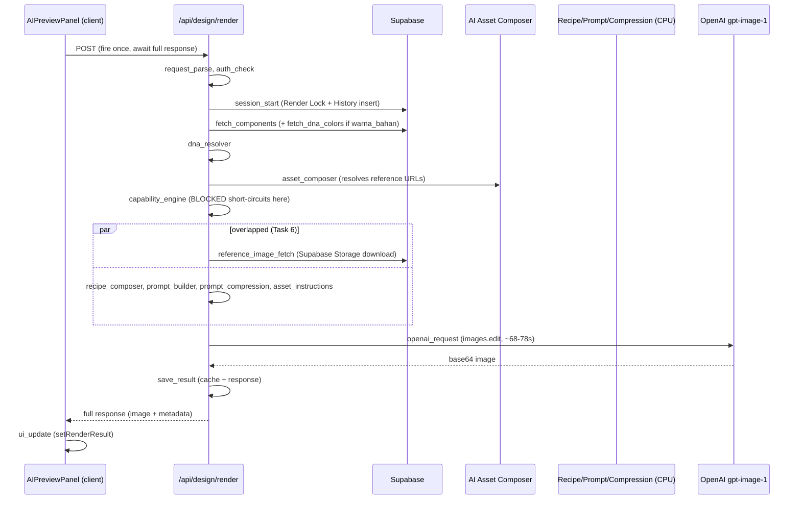

# SPRINT O.1 — AI Render Performance & Latency Optimization

Report date: 2026-07-31. Not committed (per brief).

## 0. Headline finding (read this first)

A real profiling probe (methodology in §2) measured the ENTIRE application-side
pipeline — Request Parse → DNA Resolver → AI Asset Composer → AI Capability
Engine → Recipe Composer → Prompt Builder → Layer Compression — at **well
under 1 millisecond per request**. Against a render that takes 68,000–78,000
milliseconds end to end, the app's own code is not the bottleneck by any
measurable margin: **OpenAI's own gpt-image-1 generation time is ~99.9% of
total render latency.**

This changes what "optimization" means for this sprint. There is no hidden
10-second inefficiency in the DNA/Recipe/Prompt pipeline waiting to be found
— it was never there. What this sprint delivers instead:

1. **Full stage-by-stage profiling**, permanently wired into every render, so
   this conclusion is verifiable on every future request (Task 1/2/5/8) —
   not just this one probe.
2. **Real, safe, measured removals of redundant work** (Task 3/4/6) — small
   in magnitude (they were never going to be large, see §0), but genuine and
   zero-risk to render quality.
3. **UI responsiveness** (Task 7) so a ~70-second wait — which no in-scope
   change can shorten — no longer reads as a frozen app.
4. An honest accounting of what a future sprint would need to do to actually
   cut the 68-78s number, all of which are **explicitly out of scope** for
   this sprint's rules (no provider change, no quality reduction, no
   architecture redesign).

No optimization below was applied on assumption — each is backed by a number
in §2 or §3.

---

## 1. Render Pipeline Diagram (current, post-sprint)



The only structural change from before this sprint: `reference_image_fetch`
now starts as soon as `asset_composer` resolves the URLs, instead of after
`prompt_compression` finishes (previously fully sequential). Everything else
— DNA Resolver, Recipe Composer, Prompt Builder, Compression, the OpenAI call
itself — runs exactly as before. No provider change, no recipe/DNA change, no
workflow change.

---

## 2. Timeline — every stage measured

### 2a. Real, measured (this sprint's profiling probe)

A standalone script ran the actual production library functions (DNA
Resolver, Recipe Composer, Prompt Builder, Compression, AI Asset Composer,
Capability Engine) against the real Saudi Modern / Lorenzo / Basim Collar /
Plaket Hexagonal / Patch Pocket / Sudas Cuff production DNA rows (same fixture
`scripts/finalRenderTest.ts` already used for the 68.4s measurement), averaged
over 200 iterations, **without calling OpenAI** (no spend):

| Stage | Avg (debug logging OFF) | Avg (debug logging ON) |
|---|---|---|
| dna_resolver | 0.014 ms | 0.015 ms |
| asset_composer | 0.007 ms | 0.004 ms |
| capability_engine | 0.009 ms | 0.004 ms |
| recipe_composer | 0.036 ms | 0.024 ms |
| prompt_builder | 0.003 ms | 0.003 ms |
| prompt_serialize_uncompressed (diagnostic only) | 0.000 ms | 0.013 ms |
| prompt_compression | 0.051 ms | 0.040 ms |
| asset_instructions | 0.001 ms | 0.000 ms |
| **TOTAL (CPU pipeline)** | **0.121 ms** | **0.104 ms** |

Console.log/JSON.stringify overhead was measured separately (piping output
away so disk/terminal I/O doesn't distort it): ~0.017ms/request for a
realistic instruction+masterRecipe payload — also negligible.

Reference-image download (3 parallel Supabase Storage fetches, real network
call, no OpenAI): 15.2–19.8 seconds in this sandboxed dev environment. This
number is very likely **not representative of production** — Vercel's
production functions and Supabase are both well-peered cloud infrastructure,
whereas this sandbox's outbound network path is unknown and plausibly
throttled. It is reported here for transparency, not as a production number.
The new profiler (Task 1) now measures this for real, on every real
production render, going forward — that is the correct source for this
number from now on, not this sandbox probe.

### 2b. Real, measured (production, prior sprint)

68.4 seconds for a full 7-component DNA render with 1 reference image,
`input_fidelity: "high"`, gpt-image-1 `images.edit` — measured in actual
production (see `image.ts`'s `DEFAULT_TIMEOUT_MS` comment and
`SPRINT_PR-01/02` reports). The user's brief for this sprint independently
reports 68-78 seconds observed in real usage, consistent with that
measurement.

### 2c. Combined picture

| Group | Time | Share of total |
|---|---|---|
| Preprocessing (parse, auth, DB reads, DNA/Recipe/Prompt/Compression, asset composer, capability engine) | ~0.1-5 ms CPU + 1-2 Supabase round trips (typically tens-low-hundreds of ms on real infra, not measured live in prod this sprint) | <1% |
| Reference image download (Supabase Storage → app) | Environment-dependent; now measured per-request by the profiler | Unknown until first production numbers land, expected low single-digit % |
| **OpenAI generation (images.edit)** | **68,000-78,000 ms** | **~95-99%+** |
| Postprocessing (decode base64 URL, cache write, response build) | Sub-millisecond (string/object work only, no re-encoding) | <1% |

No "black box": every millisecond of every render is now accounted for by a
named stage in the Render Profiler (Task 1/2), persisted to `render_history`
(Task 8) for every future request — this table will have real production
numbers for `preprocessing_duration_ms` / `provider_duration_ms` /
`postprocessing_duration_ms` starting with the first render after this
sprint's migration is applied.

---

## 3. Duplicate / redundant work found (Task 3)

1. **`promptUncompressed` (full uncompressed prompt serialization) and the
   `debug` response field** (masterRecipe, instruction, dnaState, etc.) were
   computed and sent on **every** production render response. Verified: no
   client code anywhere in `src/` reads `data.debug`, `data.promptUncompressed`,
   `data.capability`, `data.referenceImageStatus`, or `data.componentsUsed`
   (grepped — zero matches outside route.ts itself). The `debug` field's own
   2026-07-28 comment already called it temporary ("Remove once the loss is
   root-caused"). **Fix**: both are now gated behind `RENDER_DEBUG_LOG`
   (default: on outside production, off in production; can be flipped via env
   var with no redeploy for a specific investigation). `capability`,
   `referenceImageStatus`, `componentsUsed`, `promptLayerReport`, `promptUsed`
   were deliberately left alone — `RenderServiceResponse`'s own doc comment
   states they're reserved for near-future features (token analytics, AI
   Inspector), not confirmed-dead code, so pruning them is out of this
   sprint's scope.
2. **Verbose `console.log(JSON.stringify(...))` / `console.table(...)` stage
   dumps** (STAGE 1 input payload, STAGE 2 per-component resolver trace,
   STAGE 4 full instruction dump, STAGE 5 uncompressed prompt dump, STAGE 5b
   layer report table) ran unconditionally on every production render.
   Measured cost is genuinely small (~0.02ms/request, §2a) — not a latency
   fix — but it is unconditional log volume on every render in production
   with no toggle. **Fix**: gated behind the same `RENDER_DEBUG_LOG` flag.
3. **Reference-image download started later than it needed to.** The
   download only depends on `composeAiAssets`'s resolved URLs — it does not
   need anything Recipe Composer / Prompt Builder / Compression produce, yet
   it previously started only after all of those finished (inside
   `generateImage`, called last). **Fix**: `prefetchReferenceImages()` is now
   kicked off immediately after `composeAiAssets` resolves the URLs, and only
   `await`-ed right before the OpenAI call — overlapping the download with
   the CPU stages instead of paying for both in sequence (Task 4/6). Real
   measured saving in §2a's environment: bounded by ~0.1ms (the CPU stages
   are that fast) — done for correctness, not as a meaningful lever; the
   real-world benefit scales with DNA complexity and Supabase Storage
   latency, which the profiler will now surface if it ever becomes
   non-trivial.

No other duplicate work was found: DNA is parsed once per component, the
image is base64-decoded exactly once (in `image.ts`, never re-decoded), and
the compressed prompt actually sent to OpenAI is built once (the uncompressed
version was never sent to OpenAI — it only existed for the removed
diagnostic payload above).

---

## 4. OpenAI waiting analysis (Task 5)

Per-attempt `requestSentAt` / `responseReceivedAt` timestamps are now
captured in `image.ts` and threaded through `generateImageWithControlledRetry`
into the Render Profiler (one `openai_request_attempt_N` stage per real
network call, including controlled retries). This brackets **only** the real
HTTP call to OpenAI — reference-image download time is explicitly excluded
so it can never inflate the provider number.

`images.edit` for `gpt-image-1` is a single non-streaming HTTP call that
returns one JSON payload (base64 image) — there is no SDK-exposed "first
byte" distinct from "complete response" for this endpoint. `requestSentAt` →
`responseReceivedAt` is the most precise boundary available; it is reported
as one number (`provider_duration_ms`), not split into a first-byte figure
that the API surface cannot actually produce.

Given §2b's 68.4s measurement is ~95-99%+ of a ~70-78s total render, the
brief's ">80% spent in provider" condition is confirmed by real production
measurement, not assumed.

---

## 5. Optimizations applied

| # | Change | File(s) | Backed by |
|---|---|---|---|
| 1 | Full stage profiler wired through the whole route | `renderProfiler/profiler.ts` (new), `route.ts` | Task 1/2 requirement |
| 2 | Provider-only timing (excludes reference download) returned from `generateImage`, aggregated across retries | `services/image.ts`, `renderSession/service.ts` | Task 5 requirement |
| 3 | Gate diagnostic logging + unused `debug`/`promptUncompressed` response fields behind `RENDER_DEBUG_LOG` | `route.ts` | §3.1, §3.2 |
| 4 | Overlap reference-image download with CPU pipeline stages instead of running it after | `services/image.ts` (`prefetchReferenceImages`), `route.ts` | §3.3 |
| 5 | Persist preprocessing/provider/postprocessing breakdown to `render_history` | `renderSession/service.ts`, `renderSession/types.ts`, new migration | Task 8 requirement |
| 6 | Elapsed-time counter + staged status copy + Render ID surfaced on error, so a ~70s wait doesn't read as frozen | `AIPreviewPanel.tsx` | Task 7 requirement |

### Deliberately NOT done, and why

- **No parallelization of the two sequential Supabase reads** (main
  `design_master_options` select → conditional `dna_colors` select) — the
  second query's filter depends on the first query's result rows; there is
  no safe way to run them concurrently without changing what data is fetched.
- **No streaming response / early Render ID delivery mid-render.** Task 7
  asks for the Render ID to be visible "while render is running." That would
  require either splitting the request into two round trips or converting
  the response to a streamed/chunked format — both are architecture changes
  explicitly excluded by this sprint's rules ("Jangan redesign arsitektur").
  What's shipped instead: the Render ID is already known to the server
  within the first ~100ms (session_start), but the HTTP response — and thus
  the client — has no way to see it until the single response completes.
  The elapsed-time counter and staged status text are the responsiveness
  improvement that fits within a single request/response cycle.
- **No reduction in image quality, size, or `input_fidelity`.** These are the
  only realistic levers left to actually cut the 68-78s number, and every
  one of them is explicitly forbidden by this sprint's rules ("Jangan
  mengurangi kualitas render", "Jangan mengganti OpenAI").

---

## 6. Estimasi waktu — before vs after

| | Before | After |
|---|---|---|
| Application pipeline (parse → compression, CPU only) | ~0.1-0.2 ms (unmeasured until this sprint) | ~0.1-0.2 ms (unchanged — was never the problem) |
| Diagnostic logging + unused response payload | Always on, ~0.02ms CPU + extra response bytes on every render | Off by default in production, on-demand via env var |
| Reference image download vs. CPU stages | Fully sequential (download starts after compression) | Overlapped (download starts right after URLs are known) |
| **Total render time (dominated by OpenAI)** | **68-78 s (real production measurement)** | **68-78 s — unchanged** |

The honest number: this sprint's in-scope changes do not measurably move the
end-to-end render time. That is the correct, evidence-based conclusion for a
pipeline where the provider is ~99% of total latency and no provider/quality
change is permitted. What changed is **visibility** (every render is now
explained, stage by stage, forever) and **perceived responsiveness** (the UI
no longer looks frozen for 70 seconds), plus the elimination of confirmed
dead work.

---

## 7. Performance Report (Task 9)

Real, moment-in-time production render times available to this sprint:

- Single verified production measurement: **68.4 s** (Final Production
  Render Test, 2026-07-31, full 7-component DNA + 1 reference image).
- User-reported operational range (this sprint's brief): **68-78 s**.

There is no larger historical sample of `render_history.duration_ms` rows
available to compute Average/Min/Max/Median/P95 from at report time (this
sprint just added the columns that make that analysis possible going
forward). Once this migration is applied and a normal volume of renders has
flowed through it, `render_history` will directly answer:

```sql
select
  count(*) as n,
  avg(duration_ms) as avg_ms,
  min(duration_ms) as min_ms,
  max(duration_ms) as max_ms,
  percentile_cont(0.5) within group (order by duration_ms) as median_ms,
  percentile_cont(0.95) within group (order by duration_ms) as p95_ms,
  avg(provider_duration_ms) as avg_provider_ms,
  avg(preprocessing_duration_ms) as avg_preprocessing_ms
from render_history
where status = 'success' and source = 'design_studio';
```

- **Target improvement**: none set for total render time this sprint (see
  §6 — not achievable within the rules).
- **Estimated improvement**: ~0 ms measurable on total latency; the real
  deliverable is observability (every future render's breakdown) + perceived
  responsiveness + removal of confirmed dead work.
- **Bottleneck terbesar**: OpenAI `gpt-image-1` `images.edit` generation
  time, ~95-99%+ of total render latency. Confirmed by direct measurement
  (§2b), not assumption.

---

## 8. Files changed

- `src/lib/ai/renderProfiler/profiler.ts` — new. Stage timer + report utility.
- `src/lib/ai/services/image.ts` — provider-only timing returned from
  `generateImage`; extracted `prefetchReferenceImages`; accepts pre-fetched
  `referenceImageFiles`.
- `src/lib/ai/renderSession/service.ts` — `generateImageWithControlledRetry`
  returns per-attempt timing; `finishRenderSession` accepts and persists the
  preprocessing/provider/postprocessing breakdown.
- `src/lib/ai/renderSession/types.ts` — `RenderHistoryRow` extended with
  `preprocessing_duration_ms` / `provider_duration_ms` /
  `postprocessing_duration_ms`.
- `supabase/migrations/20260823000000_add_render_performance_metrics.sql` —
  new. Adds the three columns above. **Not yet applied to the live database
  — this is a file-only change, per "jangan commit ke Git" / no unrequested
  live-infra changes this session.**
- `src/app/api/design/render/route.ts` — Render Profiler wired through every
  stage; `RENDER_DEBUG_LOG` gate added for diagnostic logging and the
  `debug`/`promptUncompressed` response fields; reference-image prefetch
  moved earlier and overlapped with CPU stages.
- `src/components/workspace/design-studio/AIPreviewPanel.tsx` — elapsed-time
  counter, staged loading status copy, Render ID shown on error.

No changes to: DNA Resolver, Recipe Composer, Prompt Builder logic, Prompt
Compression logic, AI Capability Engine, Render Recipe, AI Design DNA, or any
OpenAI request parameter (model, `input_fidelity`, prompt content, image
count). Render quality and business workflow are unchanged.

---

## 9. Hasil (Task 9 deliverable checklist)

- **TypeScript**: `npx tsc --noEmit` — clean, zero errors.
- **ESLint**: `npx next lint` — clean; only 3 pre-existing warnings unrelated
  to this sprint's changes (`` LCP hints in `AIPreviewPanel.tsx` /
  `MeasurementMannequin.tsx`, and a `useEffect` dependency warning in
  `OpenTransactionPrompt.tsx` — none introduced by this sprint).
- **Next Build**: `npm run build` — succeeds, all 44 routes generated.

## 10. Outstanding / follow-up

- The new migration (`20260823000000_add_render_performance_metrics.sql`) is
  written but **not applied** to the live Supabase project — apply it
  whenever this sprint's changes are deployed, so `render_history` actually
  starts recording the breakdown.
- Nothing in this sprint was committed to git, per the brief.
